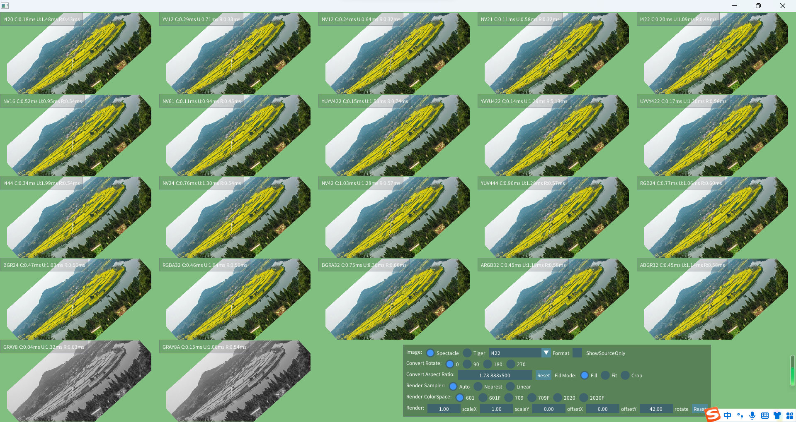

# TextureIO 
## TextureIO是一个用于视频帧的转换库，以及到图形API的IO库，主要包含以下功能

- 内存视频帧上传至GPU纹理
- 纹理读取至内存（计划内）
- 硬件视频帧映射至GPU纹理 (计划内)
- 内存视频帧格式相互转换，同时可以进行角度转换，尺寸缩放，AspectCrop裁剪，AspectFit包围
- 为内存视频帧提供参考shader供宿主图形程序使用（顶点着色器包含位移，旋转，缩放的设置）
- 提供简单API进行视频帧直接渲染，宿主程序可将其作为黑盒使用 （宿主程序可绑定帧缓冲来获取到图像）
- 支持bt601, bt709, bt2020, bt601 full range, bt709 full range, bt2020 full range渲染
- 内存视频帧转换使用libyuv实现，性能优异
- 实现了any to any的格式转换，根据输入格式，选择i420,i422,i444,rgba32作为中间格式，避免质量损失。
- 中间格式可以和任意格式直接转入和转出，某些转换可以绕过中间格式选择优化转换器。

目前支持的视频帧格式:
I420,YV12,NV12,NV21,I422,NV16,NV61,YUYV422,YVYU422,UYVY422,I444,NV24,NV42,YUV444,RGB24,BGR24,RGBA32,BGRA32,ARGB32,ABGR32,GRAY8,GRAY8A

目前支持的图形API:
OpenGL，OpenGL ES

计划中图形API:
DirectX9/11/12, Vulkan, Metal

计划中硬件视频格式:
Linux: VAAPI,VDPAU,DRM Prime. Windows:ID3D11Texture2D,ID3D11VideoDecoderOutputView,LPDIRECT3DSURFACE9. Android: HardwareBuffer. Apple:VideoToolBox

支持的OS:
Linux,Windows(已测试)
macOS，iOS，Android，*BSD（未测试，计划中）

目前项目处于紧密开发中，作为多媒体框架SDMP，短视频SDK Brilliant的功能子库存在，但可以单独使用
编译需要三方依赖库，请clone https://github.com/MountainRipper/third_party.git 到同级目录，并运行build.sh进行编译(linux),windows先运行build.bat,这将会首先安装msys2环境并启动，此时项目被挂载到/MountainRipper/third_party，进入该目录运行build.sh即可(会自动安装编译器和所需工具)

该项目以及SDMP，Brilliant将会持续开发，感兴趣的可以保持关注，欢迎加入讨论群

二维码失效可加我本人

